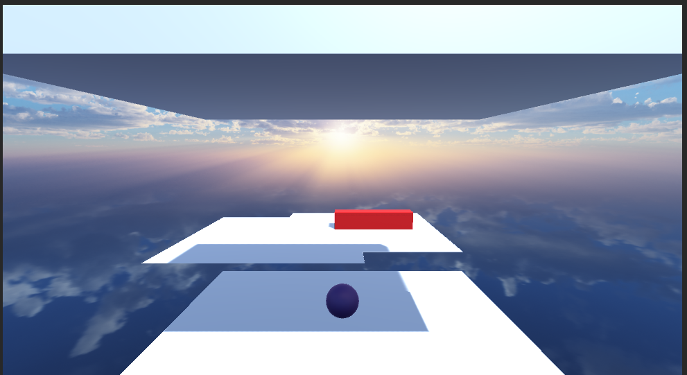

# runClone - Endless Runner Game

runClone is an adrenaline-fueled endless runner game designed to test your reflexes. With a dynamic and ever-evolving set of obstacles, each run offers a fresh challenge as you navigate treacherous terrain and strive to maintain your pace.

## Gameplay

Experience the thrill of the chase as you guide your character through a world where every second counts and every jump could be your last.

## Game Over/Restart Screen

Face your fate on the Game Over screen, where a moment's rest is your cue to restart the adventure. How far can you push the limits?

## Features

- **Procedural Generation**: Infinite landscapes ensure a unique experience every time.
- **Streamlined Controls**: Designed for quick learning with a focus on depth and mastery.
- **Dynamic Challenges**: Obstacles and environments that react to your gameplay style.
